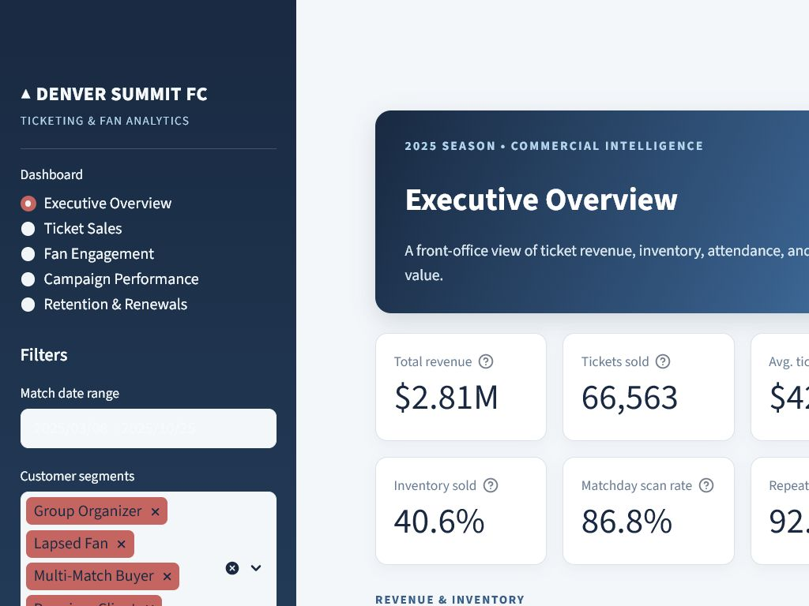
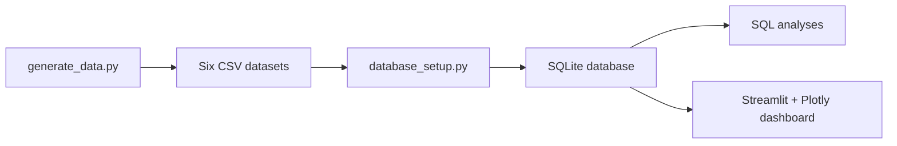

# Denver Summit FC Ticket Sales & Fan Engagement Analytics Dashboard


A complete sports business intelligence portfolio project built around a fictional professional soccer club. The project combines synthetic ticketing, CRM, attendance, and campaign data in a SQLite warehouse and presents decision-ready insights through an interactive Streamlit dashboard.

> All club, customer, and transaction data in this repository is synthetic. Any resemblance to real people is coincidental.



## Business problem

Denver Summit FC needs one reliable view of its commercial performance. Ticket sales may be pacing well while attendance lags, a high-volume campaign may produce weak revenue, or valuable supporters may be approaching renewal without the right outreach.

This project answers the questions a ticketing and CRM analyst would hear from the front office:

- Are revenue and inventory pacing toward season targets?
- Which ticket products, matches, and customer segments create the most value?
- Do sold tickets turn into matchday attendance?
- Which campaign channels generate conversions and attributed revenue?
- Which supporters are repeat buyers, likely renewers, or high-value retention risks?

## Why this matters for a sports club

Ticketing data is more than a sales report. It affects cash flow, matchday atmosphere, staffing, sponsor value, and long-term fan relationships. Combining purchase, scan, campaign, and CRM data helps a club move from descriptive reporting to targeted action:

- Release inventory or launch promotions before low-demand matches.
- Prioritize sales-representative outreach to high-value groups.
- Match campaign channels to fan intent and preference.
- Identify sold-but-unused seats that could be transferred or resold.
- Focus renewal resources on valuable supporters whose likelihood is declining.

## Project architecture

```text
.
├── app/
│   ├── __init__.py
│   └── dashboard.py
├── data/
│   ├── customers.csv
│   ├── tickets.csv
│   ├── matches.csv
│   ├── attendance.csv
│   ├── campaigns.csv
│   ├── campaign_conversions.csv
│   └── denver_summit_fc.db
├── screenshots/
├── sql/
│   ├── attendance_rate.sql
│   ├── campaign_conversion.sql
│   ├── customer_segments.sql
│   ├── matchday_inventory.sql
│   ├── renewal_likelihood.sql
│   └── revenue_pacing.sql
├── AGENTS.md
├── database_setup.py
├── generate_data.py
├── README.md
└── requirements.txt
```

The pipeline is intentionally simple and reproducible:



## Dataset description

| Dataset | Grain | Example fields |
|---|---|---|
| `customers.csv` | One row per CRM customer | Segment, location, join date, preferred channel, lifetime value, renewal score |
| `tickets.csv` | One row per customer ticket order for a match | Ticket type, quantity, unit price, revenue, section, purchase date, sales channel |
| `matches.csv` | One row per home match | Date, opponent, competition, capacity, demand index, result |
| `attendance.csv` | One scan summary per ticket order | Tickets issued, tickets scanned, scan timestamp, gate, attendance status |
| `campaigns.csv` | One row per marketing campaign | Channel, target segment, audience, budget, objective |
| `campaign_conversions.csv` | One row per campaign recipient | Sent, opened, clicked, converted, conversion revenue |

The generator uses a fixed random seed, segment-specific purchase behavior, ticket-type pricing, match demand, and channel-specific funnel probabilities. Rerunning it produces a stable dataset that remains realistic enough for repeatable analysis.

## Dashboard pages

1. **Executive Overview** — headline commercial KPIs, revenue pacing, product mix, and automatically generated business insights.
2. **Ticket Sales** — revenue by product, tickets by segment, match-level inventory, and revenue pacing.
3. **Fan Engagement** — matchday scan performance, customer distribution, and attendance by ticket type.
4. **Campaign Performance** — send-to-conversion funnel, channel comparison, attributed revenue, and ROAS.
5. **Retention & Renewals** — repeat purchase, renewal likelihood, lifetime value, and a high-value risk worklist.

Global filters let the user change the match date range, customer segments, and ticket products. The campaign page adds a channel filter.

## Dashboard KPIs

| KPI | Definition |
|---|---|
| Total revenue | Sum of ticket order revenue |
| Tickets sold | Sum of ticket quantity |
| Average ticket price | Ticket revenue divided by seats sold |
| Inventory sold % | Seats sold divided by match capacity |
| Matchday scan rate | Tickets scanned divided by tickets issued |
| Campaign conversion rate | Conversions divided by campaign sends |
| Customer segment distribution | CRM customers by assigned behavioral segment |
| Repeat buyer rate | Share of active buyers purchasing two or more distinct matches |
| Renewal likelihood score | Synthetic 0–100 customer propensity score |
| Member renewal rate | Confirmed renewals divided by season-ticket members |

## SQL analysis overview

- [`revenue_pacing.sql`](sql/revenue_pacing.sql) — match revenue, cumulative revenue, and inventory pacing with a window function.
- [`attendance_rate.sql`](sql/attendance_rate.sql) — issued seats, scans, scan rate, and venue utilization.
- [`campaign_conversion.sql`](sql/campaign_conversion.sql) — campaign funnel, attributed revenue, and return on ad spend.
- [`customer_segments.sql`](sql/customer_segments.sql) — customer value, purchase frequency, revenue, and attendance by segment.
- [`renewal_likelihood.sql`](sql/renewal_likelihood.sql) — renewal tiers, confirmed renewals, and lifetime value at risk.
- [`matchday_inventory.sql`](sql/matchday_inventory.sql) — sold, remaining, scanned, and unused paid inventory.

Each query runs directly against `data/denver_summit_fc.db` and is written for SQLite.

## Run locally

Python 3.10 or newer is recommended.

```bash
# 1. Create and activate a virtual environment (recommended)
python -m venv .venv

# Windows PowerShell
.venv\Scripts\Activate.ps1

# macOS / Linux
source .venv/bin/activate

# 2. Install packages
pip install -r requirements.txt

# 3. Recreate the synthetic CSV files
python generate_data.py

# 4. Load the CSV files into SQLite
python database_setup.py

# 5. Start the dashboard
streamlit run app/dashboard.py
```

Streamlit will print a local URL, usually `http://localhost:8501`.

## Reproducibility and validation

Run these lightweight checks after making changes:

```bash
python -m compileall generate_data.py database_setup.py app
python generate_data.py
python database_setup.py
streamlit run app/dashboard.py
```

